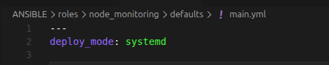

# Ansible Deployment

Ansible is used to configure the target virtual machine and deploy the `node-monitoring` application.

The project uses the `node_monitoring` Ansible role.

The role supports two deployment modes:

- `systemd` — runs the application as a Linux system service;
- `docker` — runs the application inside a container.

The role is designed to work with:

- Debian 12
- Rocky Linux 9

## Ansible Role Structure

The role is located in:

```text
roles/node_monitoring
```

The role contains the following main directories:

```text
roles/node_monitoring/
├── defaults/
├── files/
├── handlers/
├── meta/
├── molecule/
├── tasks/
├── templates/
├── tests/
└── vars/
```

## Deployment Mode

The deployment mode is configured in:

```text
roles/node_monitoring/defaults/main.yml
```

For `systemd` mode:

```yaml
deploy_mode: systemd
```

For container deployment:

```yaml
deploy_mode: docker
```

The `deploy_mode` variable should not be redefined in `vars/main.yml`, because variables defined in `vars` have higher priority.

## Systemd Mode

When `deploy_mode` is set to `systemd`, the role performs the following actions:

- installs the required Python packages;
- creates the application directory;
- copies the `app.py` file;
- copies `requirements.txt`;
- creates a Python virtual environment;
- creates a systemd unit file;
- performs systemd daemon reload;
- starts the `node-monitoring` service.

The main tasks are defined in:

```text
roles/node_monitoring/tasks/main.yml
```

## Application Files

The role copies the application files to the target machine.

The application includes:

```text
app.py
requirements.txt
```

A Python virtual environment is created for the application dependencies.

## Systemd Service

In `systemd` mode, the role creates a systemd service for `node-monitoring`.

After deployment, the service can be checked with:

```bash
sudo systemctl status node-monitoring
```

A successful deployment should show:

```text
active (running)
```

The application listens on port `8080`.

The listening port can be checked with:

```bash
ss -tulnp | grep 8080
```

If the Python process is listening on:

```text
0.0.0.0:8080
```

the service has started successfully.

## Docker Mode

When the deployment mode is changed to:

```yaml
deploy_mode: docker
```

the application is deployed inside a container.

On Debian, Docker is used.

After deployment, check the running container with:

```bash
docker ps
```

The output should contain the container:

```text
node-monitoring
```

The container should expose port:

```text
8080
```

## Rocky Linux and Podman

On Rocky Linux 9, Podman is used instead of Docker.

For this reason, the role contains additional Podman tasks:

```text
podman_build.yml
podman_run.yml
```

After deployment on Rocky Linux, check the container with:

```bash
sudo podman ps -a
```

The `node-monitoring` container should be running and expose port `8080`.

## Running the Ansible Playbook

The main Ansible playbook is located in the root of the repository:

```text
playbook.yml
```

The inventory file is:

```text
inventory.ini
```

The playbook can be executed with:

```bash
ansible-playbook -i inventory.ini playbook.yml
```

Ansible applies the `node_monitoring` role to the target host and deploys the application according to the selected deployment mode.

## Verification

After the Ansible deployment completes, verify the service depending on the selected mode.

For `systemd`:

```bash
sudo systemctl status node-monitoring
```

For Docker:

```bash
docker ps
```

For Podman:

```bash
sudo podman ps -a
```

The deployment is successful when the `node-monitoring` application is running and port `8080` is available.
