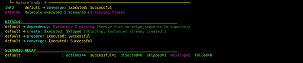
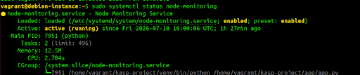
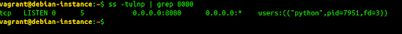
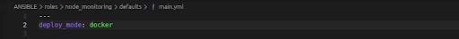
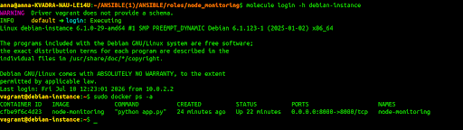
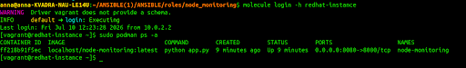

# Molecule Testing

Molecule is used to test the `node_monitoring` Ansible role in isolated virtual machines before deployment.

The role supports two deployment modes:

- `systemd` — runs the application as a Linux system service without containerization.
- `docker` — runs the application inside a container.

The role is tested on:

- Debian 12
- Rocky Linux 9

Vagrant is used to create the virtual machines required for testing.

## Molecule Scenario

The Molecule scenario is located in:

```text
roles/node_monitoring/molecule/default
```

The main scenario files are:

- `molecule.yml` — describes the virtual machines used for testing.
- `converge.yml` — applies the tested Ansible role.
- `verify.yml` — performs the final verification of the deployment.

## 1. Configure Systemd Mode

To test the role in `systemd` mode, open:

```text
roles/node_monitoring/defaults/main.yml
```

Set the deployment mode to:

```yaml
deploy_mode: systemd
```

The `deploy_mode` variable should not be redefined in `vars/main.yml`, because variables defined in `vars` have higher priority.

In `systemd` mode, the role performs the following actions:

- installs the required Python packages;
- creates the application directory;
- copies `app.py`;
- copies `requirements.txt`;
- creates a Python virtual environment;
- creates a systemd unit file;
- performs systemd daemon reload;
- starts the `node-monitoring` service.

## 2. Create the Test Environment

Create the Molecule test environment:

```bash
molecule create
```

This command creates two virtual machines using Vagrant.

To check the created instances, run:

```bash
molecule list
```

## 3. Apply the Ansible Role

Run the Molecule test scenario:

```bash
molecule converge
```

Molecule applies the `node_monitoring` Ansible role to both virtual machines and executes the tasks defined in the role.

A successful execution should finish with return code:

```text
0
```

The scenario output should show that the `converge` stage was executed successfully.



## 4. Connect to the Test Machines

Connect to the Debian virtual machine:

```bash
molecule login -h debian-instance
```

Connect to the Rocky Linux virtual machine:

```bash
molecule login -h redhat-instance
```

## 5. Verify the Systemd Service

After connecting to a virtual machine, check the `node-monitoring` service:

```bash
sudo systemctl status node-monitoring
```

A successful deployment should show:

```text
active (running)
```

## 6. Verify Port 8080

The application listens on port `8080`.

Check the listening port:

```bash
ss -tulnp | grep 8080
```

A successful result should show the Python process listening on:

```text
0.0.0.0:8080
```


This confirms that the application started successfully.

## 7. Configure Docker Mode

If the `systemd` scenario was previously executed, destroy the existing test environment first:

```bash
molecule destroy
```

Then open:

```text
roles/node_monitoring/defaults/main.yml
```

Change the deployment mode to:

```yaml
deploy_mode: docker
```

## 8. Create the Docker Test Environment

Create fresh virtual machines:

```bash
molecule create
```

Then apply the role:

```bash
molecule converge
```

## 9. Verify Docker on Debian

Connect to the Debian VM:

```bash
molecule login -h debian-instance
```

Check the running Docker containers:

```bash
docker ps
```

A successful deployment should show a running container named:

```text
node-monitoring
```

The container should expose port:

```text
8080
```

## 10. Verify Podman on Rocky Linux

On Rocky Linux 9, Podman is used instead of Docker.

The Ansible role contains separate Podman tasks:

```text
podman_build.yml
podman_run.yml
```

Connect to the Rocky Linux VM:

```bash
molecule login -h redhat-instance
```

Check the containers:

```bash
sudo podman ps -a
```

The `node-monitoring` container should be running and expose port `8080`.

## 11. Clean Up the Test Environment

After testing is complete, remove the Molecule virtual machines:

```bash
molecule destroy
```

This cleans the Vagrant test environment and allows the next test run to start from a clean state.
